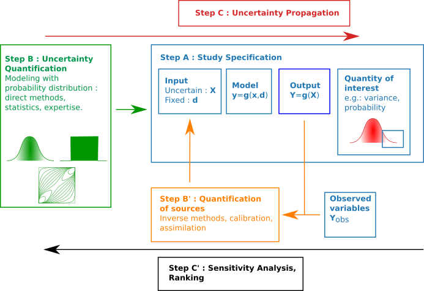

# OpenTURNS cheat sheet

This _OpenTURNS_ v1.17 cheat sheet provides a quick overview of all the programming interface. For full documentation, please read [the doc](http://openturns.github.io/openturns/master/contents.html). A beginner may be interested in the [Quick start guides](http://openturns.github.io/openturns/master/search.html?q=quick+start).

This cheat sheet follows the steps of the ABC method.

## Step A : define the study

| **Purpose** |  **Class / Method** |
|---|---|
| Import _OpenTURNS_ | `import openturs as ot` |
| Vector | `ot.Point(dimension)` |
| Sample | `ot.Sample(size, dimension)` |
| Symbolic function | `ot.SymbolicFunction(["x0", "x1"], ["1 + x0 + x1"])` |
| Python function | `ot.PythonFunction(number_of_inputs, number_of_outputs, g)` |
| Manage history and cache | `ot.MemoizeFunction(myfunction)` |
| Normal | `ot.Normal(mu, sigma)` |
| Uniform | `ot.Uniform(a, b)` |
| Multivariate distribution with independent copula | `ot.ComposedDistribution((X0, X1, X2))` |
| Input random vector | `ot.RandomVector(inputDistribution)` |
| Output random vector | `ot.CompositeRandomVector(g, inputRandomVector)` |
| Generate observations | `randomVector.getSample(sample_size)` |
| Set the seed | `ot.RandomGenerator.SetSeed(1976)` |
| Get sample size | `sample.getSize()` |
| Get sample dimension | `sample.getDimension()` |
| Compute sample mean | `outputSample.computeMean()` |
| Compute sample standard deviation | `outputSample.computeStandardDeviation()` |

## Step B : quantification of the sources of uncertainties

| **Purpose** |  **Class / Method** |
|---|---|
| Fit a Normal | `ot.NormalFactory().build(sample)` |
| Fit a Beta | `ot.BetaFactory().build(sample)` |
| Fit an histogram | `ot.HistogramFactory().build(sample)` |
| Fit a kernel density estimator | `ot.KernelSmoothing().build(sample)` |
| Draw QQ-plot | `ot.VisualTest.DrawQQplot(sample, distribution)` |
| Kolmogorov-Smirnov test (known parameters) | `ot.FittingTest.Kolmogorov(sample, distribution)` |
| Kolmogorov-Smirnov test (unknown parameters) | `ot.FittingTest.Lilliefors(sample, factory)` |
| BIC criteria | `ot.FittingTest.BIC(sample, distribution)` |

## Step C : push forward the uncertainties

| **Purpose** |  **Class / Method** |
|---|---|
| Taylor expansion | `ot.TaylorExpansionMoments(output_random_vector)` |
| Estimate mean | `ot.ExpectationSimulationAlgorithm(output_random_vector)` |
| Estimate P(Y > s) | `sample.computeEmpiricalCDF(s, True)` |
| Create the event (Y > s) | `ot.ThresholdEvent(output_random_vector, ot.Greater(), s)` |
| Create a Monte-Carlo experiment | `ot.MonteCarloExperiment()` |
| Estimate a probability | `ot.ProbabilitySimulationAlgorithm(myEvent, experiment)` |

## Step C' : sensitivity analysis

| **Purpose** |  **Class / Method** |
|---|---|
| Perform linear regression | `ot.LinearLeastSquares(sampleX, sampleY)` |
| Standardized regression coefficients | `ot.CorrelationAnalysis_SignedSRC(sampleX, sampleY)` |
| Draw indices | `ot.SobolIndicesAlgorithm.DrawCorrelationCoefficients(SRCindices, input_names, "SRC coefficients")` |
| Estimate Sobol' indices with given n | `ot.SobolIndicesExperiment(X, size)` |
| Estimate Sobol' indices | `estimator = ot.SaltelliSensitivityAlgorithm()` |

## Step B' : calibration

| **Purpose** |  **Class / Method** |
|---|---|
| Create the parametric model | `ot.ParametricFunction(g, calibratedIndices, thetaPrior)` |
| Linear least squares | `ot.LinearLeastSquaresCalibration(parametric_g, input_sample, output_sample, thetaPrior, "SVD")` |
| Non linear least squares | `ot.NonLinearLeastSquaresCalibration(parametric_g, input_sample, output_sample, thetaPrior)`
| Linear gaussian | `ot.GaussianLinearCalibration(parametric_g, input_sample, output_sample, thetaPrior, theta_sigma, output_covariance)` |
| Non linear gaussian | `ot.GaussianNonLinearCalibration(parametric_g, input_sample, output_sample, thetaPrior, theta_sigma, output_covariance)`
| Bayesian calibration | `ot.RandomWalkMetropolisHastings(prior, conditional, model, x_obs, y_obs, initialState, proposal)` |

## Metamodel

| **Purpose** |  **Class / Method** |
|---|---|
| Squared exponential | `ot.SquaredExponential([1.0] * dimension, [1.0])` |
| Matern 5/2 covariance | `ot.MaternModel([1.0] * dimension, 2.5)` |
| Kriging | `ot.KrigingAlgorithm(input_sample, output_sample, covarianceModel, basis)` |
| Sample from kriging | `ot.KrigingRandomVector(result, input_sample)` |
| Conditioned gaussian process | `ot.ConditionedGaussianProcess(kriging_result, mesh)` |
| Multivariate basis | `ot.OrthogonalProductPolynomialFactory(distribution_collection)`
| Polynomial chaos (given data) | `ot.FunctionalChaosAlgorithm(input_sample, output_sample)`
| Polynomial chaos (given distribution) | `ot.FunctionalChaosAlgorithm(input_sample, output_sample, distribution, adaptive_strategy, projection_strategy)` |
| Sobol' indices from chaos | `ot.FunctionalChaosSobolIndices(functional_chaos_result)` |
| Sample from chaos | `ot.FunctionalChaosRandomVector(functional_chaos_result)` |
| Validation | `ot.MetaModelValidation(input_test, output_test, metamodel)` |

## Design of experiments

| **Purpose** |  **Class / Method** |
|---|---|
| Monte-Carlo | `ot.MonteCarloExperiment(distribution, sample_size)` |
| Latin Hypercube Sampling | `ot.LHSExperiment(distribution, sample_size)` |
| Optimized LHS | `ot.SimulatedAnnealingLHS(lhs_experiment, criteria, temperature_profile)` |
| Sobol' sequence | `ot.SobolSequence(dimension)` |
| Low discrepancy sequence | `ot.LowDiscrepancyExperiment(ld_sequence, distribution, samplesize, False)` |
| Import viewer | `import openturs.viewer as otv` |
| Plot DOE | `otv.PlotDesign(sample, bounds)` |

## More resources

| **Resource** | **Link** |
|---|---|
| Forum | https://openturns.discourse.group |
| Chat | https://gitter.im/openturns/community |
| Modules | https://github.com/openturns/openturns/wiki/Modules |
| Install | http://openturns.github.io/openturns/master/install.html |
| Bugs | https://github.com/openturns/openturns/issues |
| Events | https://github.com/openturns/openturns/wiki/OpenTURNS-events |
| Bibliography | https://github.com/openturns/openturns/wiki/Bibliography |
| Bib resources | [Bibtex file](https://github.com/mbaudin47/otsupgalilee-eleve/blob/master/Bibliography_OpenTURNS/bibliography_openturns.bib) |
| Presentations | https://github.com/openturns/presentation |
