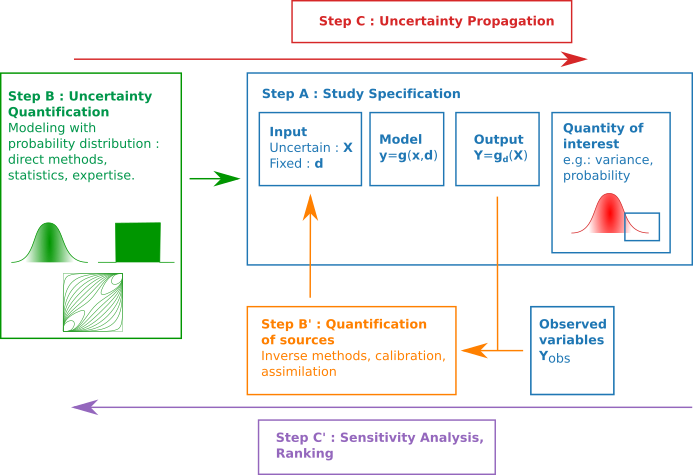

# Présentation des travaux pratiques
## Introduction
L'objectif de cette séquence est de présenter l'ensemble des séances de TP.

## Vue d'ensemble
Cours : introduction au Python, à OpenTURNS, à la méthodologie
- [Notations](Notations.md)
- [Notes informatique](Notes-informatiques.md)

