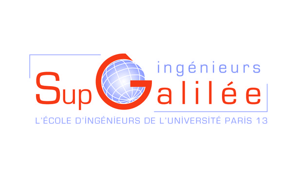
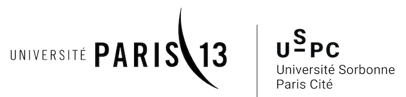

# Travaux pratiques OpenTURNS - Ecole Sup-Galilée (Université Paris XIII)







## Résumé

Le but de ce document est de présenter le déroulement des séances de travaux pratiques OpenTURNS à l'école d'ingénieurs Sup-Galilée, dans l'option Mathématiques Appliquées et Calcul Scientifique (MACS).

## Contact

- Michaël Baudin
- michael.baudin.supgalilee@gmail.com

## Objectifs

* Prise en main du logiciel
* 10 séances de 3h de mi-janvier à fin février
* Travail, éventuellement en groupe, sur un petit projet.

## Vue d'ensemble

* Séance 1 : introduction à la méthodologie ABC, à OpenTURNS
* Séance 2 : introduction à OpenTURNS, suite et fin
* Séance 3 : quantification des incertitudes - étape B
* Séance 4 : propagation des incertitudes - étape C
* Séance 5 : analyse de sensibilité globale - étape C'
* Séance 6 : créer des métamodèles de chaos
* Séance 7 : créer des métamodèles de krigeage
* Séance 8 : calage par des méthodes bayésiennes et non bayésiennes
* Séance 9 : calage par des méthodes bayésiennes et non bayésiennes - suite
* Séance 10 : introduction à SALOME et son interface graphique d'OpenTURNS

## Supports de cours

- https://github.com/mbaudin47/otsupgalilee-eleve

## Installation d'OpenTURNS

L'environnement requis pour les séances de TP est le suivant :
* Python ≥ 3.7 ;
* IPython ≥ 6.5.0 ;
* Jupyter notebook ≥ 5.6.0 ;
* Numpy ≥ 1.15 ;
* Scipy ≥ 1.1 ;
* Matplotlib ≥ 2.2 ;
* OpenTURNS ≥ 1.17 ;
* Spyder ≥ 3.3.1  (optionnel).

Pour installer OpenTURNS, je vous recommande de suivre les instructions disponibles dans la [documentation d'OpenTURNS](http://openturns.github.io/openturns/latest/install.html).

Avec Conda, l'installation d'OpenTURNS et des outils nécessaires pour les travaux pratiques se fait avec les commandes :
```
conda install openturns=1.17 otmorris
conda install jupyter matplotlib scipy
```
