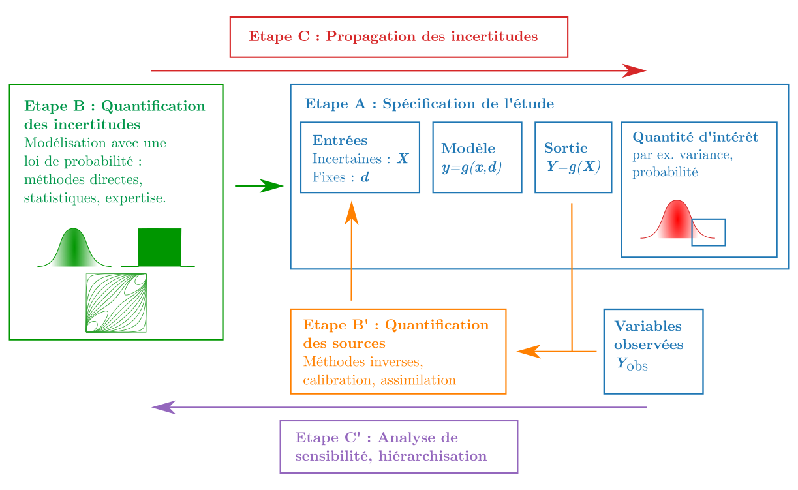

# Thème 1 : introduction à OpenTURNS
## Introduction
L'objectif de cette séquence est de réaliser une introduction à OpenTURNS, à la méthodologie générique de traitement des incertitudes et aux classes de base dans le logiciel.

## Vue d'ensemble
Introduction au Python, à OpenTURNS, à la méthodologie
- Cours : Le projet OpenTURNS : [Le projet OpenTURNS](Le-projet-OpenTURNS.md)
- Exercice : Les objets Point, Sample : [Point et Sample.ipynb](Point-et-Sample.ipynb)
- Exercice : Lois univariées, multivariées : [Distributions.ipynb](Distributions.ipynb)
- Exercice : Fonctions Python, symbolique : [Fonctions.ipynb](Fonctions.ipynb)
- Exercice : La classe RandomVector : [RandomVector.ipynb](RandomVector.ipynb)

## Devoirs
- [Somme de deux gaussiennes](Devoirs/Exercice-Somme-de-deux-gaussiennes.ipynb)
- [Simulation de pensions de retraites](Devoirs/Exercice-montant-pensions-retraites.ipynb)

## Extras
- [Utiliser Markdown avec OpenTURNS](OpenTURNS_Markdown.ipynb)

## La méthodologie ABC

