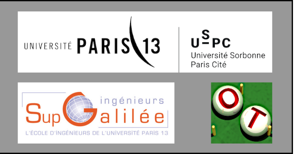

[](https://circleci.com/gh/mbaudin47/otsupgalilee-eleve)



# otsupgalilee-eleve
Cette page présente le matériel pédagogique à destination des élèves pour des cours OpenTURNS à SupGalilée (Université Paris XIII), dans l'option Mathématiques Appliquées et Calcul Scientifique (MACS). L'objectif pédagogique de ce cours est de compléter la formation des élèves sur le traitement des incertitudes par une formation qui mêle la théorie et la pratique en langage Python avec la librairie OpenTURNS.
Nous fournissons des rappels de cours ainsi que des présentations thématiques accompagnés d'exercices corrigés. Plusieurs devoirs sont fournis pour chaque thème. 

**Contact** : Michaël Baudin, michael.baudin.supgalilee@gmail.com

## Principes
Les principes généraux de la formation sont les suivants.
* Travaux pratiques OpenTURNS : 16 séances de 3h de novembre à février
* Évaluation : Travail, éventuellement en groupe, sur un projet.

La liste suivante présente un exemple de déroulement possible :
* Séance 1 : introduction à la méthodologie ABC, à OpenTURNS
* Séance 2 : introduction à OpenTURNS, suite et fin
* Séance 3 : quantification des incertitudes - étape B
* Séance 4 : propagation des incertitudes - étape C
* Séance 5 : analyse de sensibilité globale - étape C'
* Séance 6 : créer des méta-modèles de chaos
* Séance 7 : créer des méta-modèles de krigeage
* Séance 8 : calage par des méthodes bayésiennes et non bayésiennes
* Séance 9 : calage par des méthodes bayésiennes et non bayésiennes - suite
* Séance 10 : introduction à SALOME et son interface graphique d'OpenTURNS

## Table des matières
Les thèmes présentés sont les suivants :
- [Présentation](https://github.com/mbaudin47/otsupgalilee-eleve/blob/master/0-Deroulement/Presentation.md)
- [Thème 1 : Introduction à OpenTURNS](https://github.com/mbaudin47/otsupgalilee-eleve/blob/master/1-Intro-OT/Theme-1-introduction-OpenTURNS.md)
- [Thème 2 : Quantification des incertitudes](https://github.com/mbaudin47/otsupgalilee-eleve/blob/master/2-Quantification/Theme-2-quantification.md)
- [Thème 3 : Propagation des incertitudes](https://github.com/mbaudin47/otsupgalilee-eleve/blob/master/3-Propagation/Theme-3-propagation.md)
- [Thème 4 : Analyse de sensibilité](https://github.com/mbaudin47/otsupgalilee-eleve/blob/master/4-Sensibilite/Theme-4-sensibilite.md)
- [Thème 5 : Chaos polynomial](https://github.com/mbaudin47/otsupgalilee-eleve/blob/master/5-Chaos/Theme-5-chaos.md)
- [Thème 6 : Krigeage](https://github.com/mbaudin47/otsupgalilee-eleve/blob/master/6-krigeage/Theme-6-krigeage.md)
- [Thème 7 : SALOME et OpenTURNS](https://github.com/mbaudin47/otsupgalilee-eleve/blob/master/7-SALOME-OT/Theme-7-salome-ot.md)
- [Thème 8 : Calage](https://github.com/mbaudin47/otsupgalilee-eleve/blob/master/8-Calage/Theme-8-Calage.md)
- [Thème 9 : Fiabilité](https://github.com/mbaudin47/otsupgalilee-eleve/blob/master/9-Fiabilite/Exercice-FORM-SORM-cantilever-beam.ipynb)

## Installation d'OpenTURNS
L'environnement requis pour les séances de TP est le suivant :
* Python ≥ 3.7 ;
* IPython ≥ 6.5.0 ;
* Jupyter notebook ≥ 5.6.0 ;
* Numpy ≥ 1.15 ;
* Scipy ≥ 1.1 ;
* Matplotlib ≥ 2.2 ;
* OpenTURNS ≥ 1.24.

Pour installer OpenTURNS, je vous recommande de suivre les instructions disponibles dans la [documentation d'OpenTURNS](http://openturns.github.io/openturns/latest/install.html).

Avec Conda, l'installation d'OpenTURNS et des outils nécessaires pour les travaux pratiques se fait avec les commandes :
```
conda install openturns=1.24 otmorris jupyter matplotlib scipy
```

## Installation du contenu pédagogique
L'instruction suivante permet de récupérer le contenu de la formation:
```bash
git clone https://github.com/mbaudin47/otsupgalilee-eleve.git
```
